# ITS - Intelligent Transport System Architecture

## 1. Data Flow Diagram (DFD)

### Level 0 - Context Diagram

```mermaid
flowchart LR
    subgraph External["External Entities"]
        User["👤 User"]
        Camera["📹 Camera/RTSP Stream"]
        YOLOModel["🤖 YOLO Model"]
    end
    
    subgraph ITS["ITS System"]
        System["Intelligent Transport System"]
    end
    
    User -->|"View Detection, Search, Benchmark"| System
    Camera -->|"Video Frame / Image URL"| System
    System -->|"Detection Results, Violations, Stats"| User
    System -->|"Inference Request"| YOLOModel
    YOLOModel -->|"Detection Boxes"| System
```

---

### Level 1 - Main Processes

```mermaid
flowchart TB
    subgraph Frontend["🖥️ Frontend (React/Vite)"]
        P1["1.0 Detection Module"]
        P2["2.0 Search Module"]
        P3["3.0 Benchmark Module"]
    end
    
    subgraph Backend["⚙️ Backend (FastAPI)"]
        P4["4.0 Detection Service"]
        P5["5.0 Tracking Service"]
        P6["6.0 Zone Service"]
        P7["7.0 Model Manager"]
        P8["8.0 Traffic Density Service"]
    end
    
    subgraph DataStores["📁 Data Stores"]
        D1[("Camera List<br/>(cameras.csv)")]
        D2[("Zone Config<br/>(JSON)")]
        D3[("YOLO Models<br/>(.pt files)")]
        D4[("Link Data<br/>(ITS.link.json)")]
        D5[("Hourly Density<br/>(JSON)")]
    end
    
    User["👤 User"] -->|"Select Camera"| P1
    P1 -->|"HTTP Request"| P4
    P4 -->|"Load Model"| P7
    P7 -->|"Read Model"| D3
    P4 -->|"Track Objects"| P5
    P4 -->|"Check Zones"| P6
    P6 -->|"Read Zones"| D2
    P1 -->|"Get Cameras"| D1
    
    User -->|"Upload Image/Query"| P2
    P2 -->|"Search Request"| P4
    
    User -->|"Run Benchmark"| P3
    P3 -->|"Benchmark Request"| P7
```

---

### Level 2 - Detection Process Detail

```mermaid
flowchart TB
    subgraph Input["📥 Input"]
        A1["Image URL"]
        A2["Video Stream URL"]
        A3["Uploaded Image"]
    end
    
    subgraph Process["⚙️ Detection Pipeline"]
        B1["Fetch Frame"]
        B2["YOLO Inference"]
        B3["Object Tracking<br/>(SimpleTracker)"]
        B4["Zone Check"]
        B5["Violation Detection"]
        B6["Line Counting"]
        B7["Traffic Density<br/>Calculation"]
    end
    
    subgraph Output["📤 Output"]
        C1["Detections<br/>(bbox, class, confidence)"]
        C2["Vehicle Count"]
        C3["Parking Violations"]
        C4["Red Light Violations"]
        C5["Line Counts<br/>(in/out)"]
        C6["Annotated Frame"]
        C7["Density Report<br/>(flow rate, level)"]
    end
    
    A1 --> B1
    A2 --> B1
    A3 --> B1
    B1 --> B2
    B2 --> B3
    B3 --> B4
    B4 --> B5
    B4 --> B6
    B3 --> C1
    C1 --> C2
    B5 --> C3
    B5 --> C4
    B6 --> C5
    B1 --> C6
```

---

## 2. Component / Module Diagram

### System Architecture Overview

```mermaid
flowchart TB
    subgraph Client["🌐 Client Layer"]
        Browser["Web Browser"]
    end
    
    subgraph Frontend["🖥️ Frontend (React + TypeScript)"]
        direction TB
        subgraph Pages["Pages"]
            PgIndex["Index.tsx"]
            PgDetection["Detection.tsx"]
            PgSearch["Search.tsx"]
            PgBenchmark["Benchmark.tsx"]
        end
        
        subgraph Components["Components"]
            CmpCamera["CameraFeed.tsx"]
            CmpViewer["DetectionViewer.tsx"]
            CmpPolygon["PolygonEditor.tsx"]
            CmpDashboard["TrafficDashboard.tsx"]
            CmpDensity["TrafficDensityPanel.tsx"]
            CmpSearch["SearchComposer.tsx"]
        end
        
        subgraph Lib["Library"]
            API["api.ts"]
        end
        
        Pages --> Components
        Components --> API
    end
    
    subgraph Backend["⚙️ Backend (FastAPI + Python)"]
        direction TB
        subgraph Routes["Routes Layer"]
            RtDetection["detection_routes.py"]
            RtCamera["camera_routes.py"]
            RtSearch["search_routes.py"]
            RtBenchmark["benchmark_routes.py"]
            RtUpload["upload_detect_routes.py"]
            RtMedia["media_routes.py"]
            RtProxy["proxy_routes.py"]
        end
        
        subgraph Services["Services Layer"]
            SvcDetection["DetectionService"]
            SvcTracker["TrackerService"]
            SvcZone["ZoneService"]
            SvcCounting["CountingService"]
            SvcModel["ModelManager"]
            SvcCamera["CameraService"]
            SvcSearch["SearchService"]
            SvcDensity["TrafficDensityService"]
            SvcDensityStore["HourlyDensityStorage"]
        end
        
        subgraph Models["ML Models"]
            YOLO["YOLO v8/v12"]
            SimpleTracker["SimpleTracker"]
        end
        
        Routes --> Services
        Services --> Models
    end
    
    subgraph Data["📁 Data Layer"]
        Cameras[("cameras.csv")]
        Zones[("zones.json")]
        ModelFiles[("*.pt files")]
        Links[("ITS.link.json")]
        DensityData[("*_hourly.json")]
    end
    
    Browser --> Frontend
    API -->|"REST API"| Routes
    Services --> Data
```

---

### Backend Module Dependencies

```mermaid
flowchart LR
    subgraph Routes["🛣️ Routes"]
        R1["detection_routes"]
        R2["camera_routes"]
        R3["search_routes"]
        R4["benchmark_routes"]
        R5["upload_detect_routes"]
    end
    
    subgraph Services["⚙️ Services"]
        S1["DetectionService"]
        S2["TrackerService"]
        S3["ZoneService"]
        S4["CountingService"]
        S5["ModelManager"]
        S6["CameraService"]
        S7["SearchService"]
        S8["TrafficDensityService"]
        S9["HourlyDensityStorage"]
    end
    
    R1 --> S1
    R1 --> S3
    R1 --> S4
    R1 --> S8
    R2 --> S6
    R3 --> S7
    R4 --> S5
    R5 --> S1
    
    S1 --> S2
    S1 --> S5
    S1 --> S3
    S4 --> S2
    S8 --> S9
```

---

### Frontend Component Hierarchy

```mermaid
flowchart TB
    subgraph App["App.tsx"]
        Router["React Router"]
    end
    
    subgraph Pages["📄 Pages"]
        Index["Index"]
        Detection["Detection"]
        Search["Search"]
        Benchmark["Benchmark"]
    end
    
    subgraph DetectionComponents["Detection Components"]
        CameraSelectDialog["CameraSelectDialog"]
        CameraFeed["CameraFeed"]
        DetectionViewer["DetectionViewer"]
        PolygonEditor["PolygonEditor"]
        TrafficDashboard["TrafficDashboard"]
        TrafficDensityPanel["TrafficDensityPanel"]
    end
    
    subgraph SearchComponents["Search Components"]
        SearchComposer["SearchComposer"]
        TitleSearch["TitleSearch"]
        HeaderSearch["HeaderSearch"]
    end
    
    subgraph SharedUI["🎨 Shared UI"]
        SideBar["SideBar"]
        HeaderHome["HeaderHome"]
    end
    
    Router --> Pages
    Detection --> CameraSelectDialog
    Detection --> CameraFeed
    Detection --> DetectionViewer
    Detection --> PolygonEditor
    Detection --> TrafficDashboard
    Detection --> TrafficDensityPanel
    
    Search --> SearchComposer
    Search --> TitleSearch
    Search --> HeaderSearch
    
    Pages --> SharedUI
```

---

## 3. Key Data Entities

| Entity | Description | Location |
|--------|-------------|----------|
| **Camera** | Camera info (id, name, location, url) | `cameras.csv` |
| **Detection** | Detected object (bbox, class, confidence, track_id) | Runtime |
| **ZonePolygon** | Monitoring zone (parking, traffic light, stop line, counting, ignore) | `zones.json` |
| **ParkingViolation** | Vehicle overstaying in no-parking zone | Runtime |
| **LineCounts** | Vehicle counts crossing counting lines | Runtime |
| **ModelInfo** | YOLO model metadata and benchmark results | `*.pt` files |
| **TrafficDensityResult** | Density calculation (flow_rate, density_level, hourly_average) | Runtime |
| **TrafficDensityStatus** | Current tracking status (is_tracking, current_count, elapsed_minutes) | Runtime |
| **HourlyDensityData** | Historical hourly vehicle counts for comparison | `*_hourly.json` |

---

## 4. API Endpoints Summary

| Endpoint | Method | Purpose |
|----------|--------|---------|
| `/api/detect` | POST | Detect vehicles from image URL |
| `/api/detect/frame` | POST | Detect from video stream frame |
| `/api/cameras` | GET | List available cameras |
| `/api/zones/{camera_id}` | GET/POST | Get or save zone configurations |
| `/api/search` | POST | Search with image/text query |
| `/api/benchmark/run` | POST | Run model benchmark |
| `/api/models` | GET | List available YOLO models |
| `/api/models/switch` | POST | Switch active YOLO model |
| `/api/detection/{camera_id}/density/start` | POST | Start traffic density tracking |
| `/api/detection/{camera_id}/density/status` | GET | Get density tracking status |
| `/api/detection/{camera_id}/density/stop` | POST | Stop tracking and return result |
| `/api/detection/{camera_id}/density/report` | GET | Get density report without stopping |
| `/api/detection/{camera_id}/density/reset` | POST | Reset/cancel density tracking |
| `/api/detection/{camera_id}/counting/stats` | GET | Get line counting statistics |
| `/api/detection/{camera_id}/counting/reset` | POST | Reset counting statistics |
| `/api/detection/{camera_id}/counting/clear` | POST | Clear all counting data |
